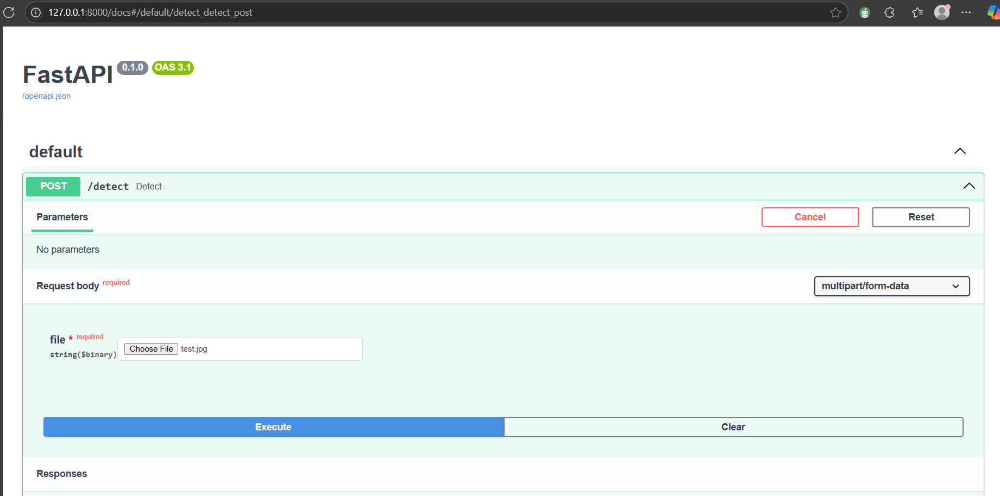
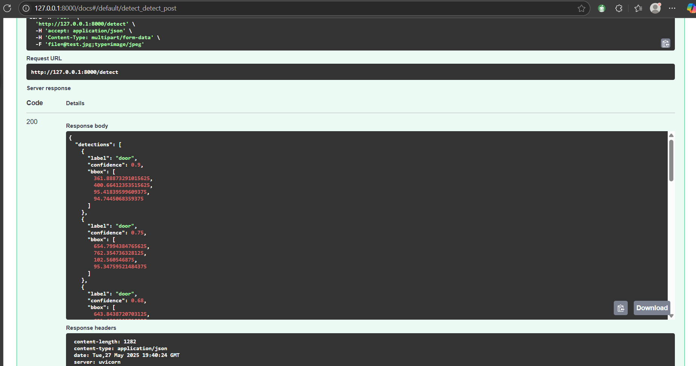

# Blueprint Vision - YOLOv8 Object Detection API

A deep learning API that detects **doors** and **windows** from blueprint-style architectural images using **YOLOv8**, created by **Pratham Asthana**.

---

## Project Overview

- **Model:** YOLOv8 (Ultralytics)
- **Task:** Detect `door` and `window` in blueprint images
- **Dataset:** 21 images with bounding box labels
- **Trained Model:** `custom_YOLOv8FINAL3`
- **Deployment:** FastAPI + Render
- **API Endpoint:** `POST /detect`

---

## Project Structure
```
Blueprint_vision/
├── main.py # FastAPI application
├── render.yaml # Render deployment config
├── requirements.txt # Python dependencies
├── data.yaml # Dataset config for YOLOv8
├── classes.txt # Object classes: door, window
├── images/
│ ├── train/
│ │ └── *.png 
│ └── val/
│ └── *.png 
├── labels/
│ ├── train/
│ │ └── *.txt
│ └── val/
│ └── *.txt
└── runs/
└── detect/
└── custom_YOLOv8FINAL3/
└── weights/
└── best.pt # Trained YOLOv8 model
```
## 🛠️ Setup Instructions

Follow these steps to set up and run the YOLOv8-based object detection API locally or for deployment.

---

### 1. Clone the Repository

```bash
git clone https://github.com/pratham-asthana/Blueprint_vision.git
cd Blueprint_vision
```
### 2. Create and Activate a Virtual Environment (Optional but Recommended)

```bash
python -m venv venv
source venv/bin/activate 
```

### 3. Install Python Dependencies

```bash
pip install ultralytics
pip install -r requirements.txt
```

### 4. Verify Project Structure

Make sure your folder has this structure:
```
Blueprint_vision/
├── main.py
├── render.yaml
├── requirements.txt
├── data.yaml
├── classes.txt
├── images/
│   ├── train/       
│   └── val/         
├── labels/
│   ├── train/       
│   └── val/         
└── runs/
    └── detect/
        └── custom_YOLOv8FINAL3/
            └── weights/
                └── best.pt
```
###  5. Run the FastAPI App Locally

```bash
uvicorn main:app --host 0.0.0.0 --port 10000
```

## CURL TEST



## Author
Pratham Asthana  
Email: prathamasthana04@gmail.com  
GitHub: https://github.com/pratham-asthana  
LinkedIn: https://www.linkedin.com/in/pratham-asthana-243133265/


